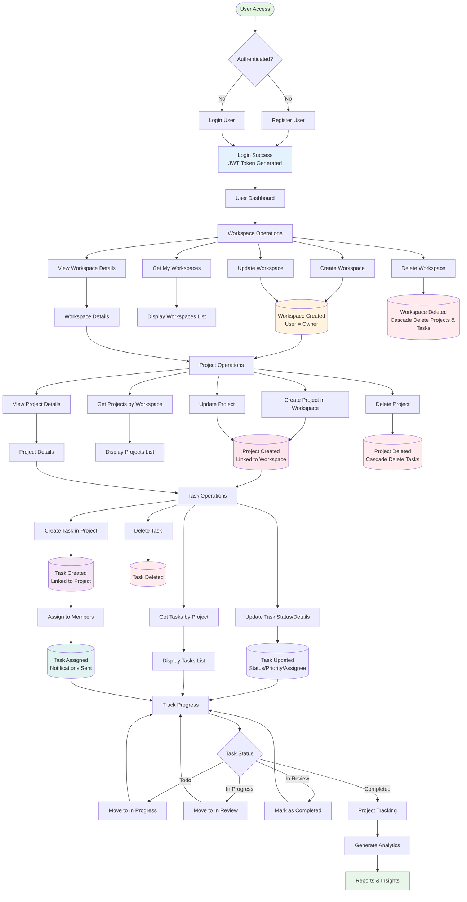

# Project Management System - Data Pipeline Flowchart

This document contains the visual representation of the data flow in the Project Management System.

## System Overview

The Project Management System follows a hierarchical structure:
- **Users** authenticate and access the system
- **Workspaces** are created and managed by users
- **Projects** are created within workspaces
- **Tasks** are created within projects and assigned to members

## Data Pipeline Flowchart



## Flow Description

### 1. Authentication Layer
- Users must authenticate to access the system
- JWT tokens are generated upon successful login
- Tokens are used for subsequent API requests

### 2. Workspace Layer
- **Create**: Users can create new workspaces (become owners)
- **Read**: View all workspaces where user is member/owner
- **Update**: Owners can modify workspace details and members
- **Delete**: Owners can delete workspaces (cascades to projects and tasks)

### 3. Project Layer
- **Create**: Create projects within a workspace
- **Read**: View all projects in a workspace
- **Update**: Update project details, members, status, dates
- **Delete**: Delete projects (cascades to tasks)

### 4. Task Layer
- **Create**: Create tasks within a project
- **Read**: View all tasks in a project
- **Update**: Update task details, status, priority, assignees
- **Delete**: Delete individual tasks

### 5. Task Status Workflow
Tasks follow a defined status flow:
1. **Todo** - Initial state
2. **In Progress** - Work has started
3. **In Review** - Awaiting review
4. **Completed** - Task finished

### 6. Data Relationships

```
User (1) ─────> (N) Workspace
                      │
                      └─> (N) Project
                               │
                               └─> (N) Task
```

### 7. API Endpoints Reference

All endpoints are documented in Swagger UI at: `http://localhost:5000/api-docs`

#### Authentication
- `POST /api/auth/register` - Register new user
- `POST /api/auth/login` - Login user
- `GET /api/auth/me` - Get current user

#### Workspace
- `POST /api/workspace/workspaces` - Create workspace
- `GET /api/workspace/workspaces` - Get all workspaces
- `GET /api/workspace/:workspaceId` - Get workspace by ID
- `PUT /api/workspace/:workspaceId` - Update workspace
- `DELETE /api/workspace/:workspaceId` - Delete workspace

#### Project
- `POST /api/project/projects` - Create project
- `GET /api/project/workspace/:workspaceId` - Get projects by workspace
- `GET /api/project/:projectId` - Get project by ID
- `PUT /api/project/:projectId` - Update project
- `DELETE /api/project/:projectId` - Delete project

#### Task
- `POST /api/task/tasks` - Create task
- `GET /api/task/project/:projectId` - Get tasks by project
- `PUT /api/task/:taskId` - Update task
- `DELETE /api/task/:taskId` - Delete task

## Color Legend

- 🟢 **Green** - Entry points and reports
- 🔵 **Blue** - Authentication success
- 🟠 **Orange** - Workspace operations
- 🩷 **Pink** - Project operations
- 🟣 **Purple** - Task operations
- 🟦 **Teal** - Task assignments and completion
- 🔴 **Red** - Delete operations

## Notes

- All operations (except register/login) require JWT authentication
- Delete operations cascade down the hierarchy
- Member validation ensures users exist in parent workspace/project
- Status transitions can be tracked for analytics and reporting
